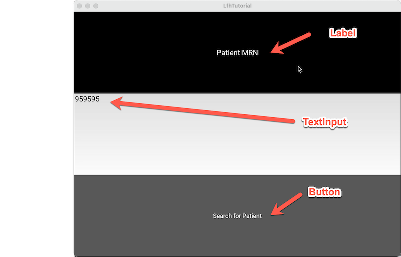

# Learning LFH Project

This project is a tutorial/demo project to test the feasibility of taking an "EMR-like" data-set (in this case loosely based on the MIMIC III public data set with synthetic enhancements) and essentially fetch one patient's record using a random MRN (959595) and then pulling the patient's notes where the built in data has a pre-canned note data (narrative) from a MIMIC III patient who with septic shock and lung cancer along with that patient's labs and medications which are also transmitted via FHIR.
The tutorial also then goes onto to do a pull of data that could be used for claims use.

This demo is deliberately essentially one file that goes sort of in one staight linear path to make it easy to understand the logic and ability to modify to try things for your purposes.

## Dependencies:
This project does not depend on any propietary or commercial libraries. The project is using Python 3.9+. The largest library dependecy for this project is for the LinuxForHealth (LFH) [Connect](https://github.com/LinuxForHealth/connect) repo (which will both provide code as well as containerized runtime services. To utilize the LFH tooling you need to clone the connect repo and have docker (with docker-compose) installed and subsequently go to the connect folder and you will see the docker-compose file in that directory and you want to execute `docker-compose up`. Now depending on your platform you *may* need to launch the docker engine application (like on a macintosh the GUI docker application must be running for docker services to exist (i.e. there is no command docker-compose when the docker app is not running). Handily the desktop engine lets you forever after start your containers from inside the GUI; And like any other docker-compose you can edit the launch config for the service (such as adding other tooling you might want such as MySQL or elastic search **(note using the containerized versions of a database may not be storage backed, as docker by default does not provide system storage to a container)**. Other dependecies you will need are located in python itself such as Kivy (this application uses Kivy to generate a cross-platform GUI). Obviously that is not required and feel free to modify this demo to use your favorite front end (or turn it into a web service and use react or whatever). Kivy was just easy since the project will run as a local desktop application. Given the mysql dependency I chose to use PyMysql and SqlAlchemy (ORM) to handle the database access. If you hate ORMs, you are probably a *psychopath*, but it's a free country. You will also need httpx, the pydantic fhir.resources, and a few other pip includes. You don't need to manually add these if you are not running your application locally (i.e. in an IDE). In PyCharm you can click on the **python packages** button at the bottom and search for whatever package you need and it will automagially add them to your venv).

## FHIR
this code is *en fuego* and ultimately will deliver this make-believe patient's clinical data to your FHIR server. Like your Miranda Rights, if you don't have a FHIR server one will be provided for you! So if you just do a basic docker compose launch you will get the IBM FHIR Server R4 launched in your docker environment. However what if, like me, you had an existing off machine FHIR server running (like say a regional HIE), you need to make a few edits as follows:

In docker-compose.yml, find the ibm-fhir section and change to something like this (or docker will install a local fhir server) - remember in YAML white space matters to make sure it matches the entries above it:

```
ibm-fhir:
    profiles: ["fhir", "deployment"]
    image: docker.io/ibmcom/ibm-fhir-server:4.4.0
    networks:
      - main
    ports:
      - 9443:9443
```
Now you may be confused by the URLs in *entrypoint.py* where the URL is pointing to "localhost" which is because remember you are sending your FHIR data to LFH's connect service which will handle the delivery to the FHIR server, and it is running locally (that whole docker thing above). So inside connect you need to tell it where the destination fhir server is located in *config.py*

Note the patient resources make heavy use of FHIR extensions such as geolocation, for the purposes of the demo. for example as below:

```json
{
  "name": [
    {
      "given": [
        "Marilyn"
      ],
      "family": "Salazar"
    }
  ],
  "gender": "female",
  "address": [
    {
      "use": "home",
      "city": "Boston",
      "line": [
        "518 James St. "
      ],
      "type": "postal",
      "state": "MA",
      "country": "USA",
      "postalCode": "02212"
    }
  ],
  "birthDate": "1918-10-09",
  "extension": [
    {
      "url": "http://hl7.org/fhir/StructureDefinition/geolocation",
      "extension": [
        {
          "url": "latitude",
          "valueDecimal": 42.446396
        },
        {
          "url": "longitude",
          "valueDecimal": -71.459405
        }
      ]
    }
  ],
  "identifier": [
    {
      "id": "48632",
      "type": {
        "id": "http://terminology.hl7.org/CodeSystem/v2-0203",
        "text": "MR"
      },
      "value": "48632",
      "system": "http://https://mimic.physionet.org/identifiers/subjectid"
    }
  ],
  "resourceType": "Patient"
}
```


## Database
The database used in this demo is provided in SQL files for MySql (or MariaDB if you prefer). In MySQL it assumes version >8 syntax but would likely work fine on version 5 servers (untested). Could this database work in Postgres/DB2/SQLServer/oracle/etc? of course, the datbase files are pretty basic SQL. The inital creation script is called *lfh_demodb.sql* and then you simply apply the the scripts in order (if you don't know how to import scripts into mysql the easiest way (if you aren't running a graphical client such as DBeaver or PhpMyAdmin is to import from the command line client as follows:
            `mysql -u<your_user_name> -p kafkaFhirDemoDb < 1.sql`
note there are no spaces between `-u` and your username. The -p does support password entry in the command but that is a huge security risk as you password is now in your shell history (it will even chastise you). You can of course rename the database from *kafkaFhirDemoDb* but you will need to edit *lfh_demodb.sql* and the python code (specifically in *DatabaseUtil.createConnectionPool()*

Note: of course you will need to edit the database url *DatabaseUtil.createConnectionPool()* to match your environment, including username/password and IP address. You of course need to specify in your mysql server that the user you select can access from an outside host if you are not running all this on localhost.

## Running
Assuming you got the docker stuff above launched, you now need to run EntryPoint.py to start the application. It will launch a desktop application called "LfhTutorial" with the strange Kivy GUI (see below)

You will want to be in the directory where [EntryPoint.py](EntryPoint.py) is contained and when you run the file it will call the following:
```
# calls the Kivy app runner to build and deploy
if __name__ == '__main__':
    LfhTutorialApp().run()
```
This will launch the gui as seen in the next section below.

To launch from the command line you will want to do `pyenv run entrypoint.py`


## GUI
WTAF?? I hear you ask. Yeah, well the point of this demo was specifically not to have a fancy UI to distract from the data workflow. I did not want to create an entire bespoke EMR (been there, done that!) so it is a demo on rails with a single button per screen (it almost feels like a powerpoint deck but it really is executing the code). So I am no Kivy master so it uses a very simplistic BoxLayout to tug the demo along with black with white text = label, White with black text = textinput and gray with white text is a clickable button (the default Kivy scheme). The sample database provided here only includes 1 patient (GI Joe with the MRN 959595) so if you change the MRN



## Typing usage
As an example healthcare application, type safety is very important and so where possible in the tutorial we will use type hints, so metho calls will have a return type hint (added in python 3). This will typically take the form of
an arrow and type definition in a method declaration like this:

```typedemo
    def getIcdCodesForAdmission(self, admissionId: int) -> List[DiagnosisIcd]:
```
Python of course does not require return type hints but in a tutorial it helps to understand what is being passed around and is a good habit to get into during healthcare sofware development. Using type hinting is a similar idea to using an ORM that does data schema checking on startup
so that you are assured that the data in a given field is the data you are seeking, so if another developer changes the database schema your code will check if the database schema is still compatible (e.g. if you added a field the ORM should ignore it and use the existing fields
- in other words your code is unchanged, but if someone deleted a field your model assumes is present that will throw a runtime error so that you never end up working with missing data). One of the problem with healthcare data is loose typing to start with, such as HL7 basically is a 1980s
- delimited file format for text and has no concept of numeric typing, so a float and an int are mixed in the same field of a lab result (ugh) as are formatted numbers like a ratio. Now python is happy to automagically deal with that, but in a clinical context you have to assure that you are
- comparing like to like (mixing types implicitly in mathematical operations is a risky move, and may not be valid even if the operation succeeds)

## Unit Testing
The tutorial doesn't have defined unit tests, mostly because the tutorial is essentially a giant unit test itself. But feel free to put in your own unit tests to expand the tutorial
co
##  The use case
The basic tutorial use case is as follows: [tutorial use case](tutorial%20use%20case.md)
